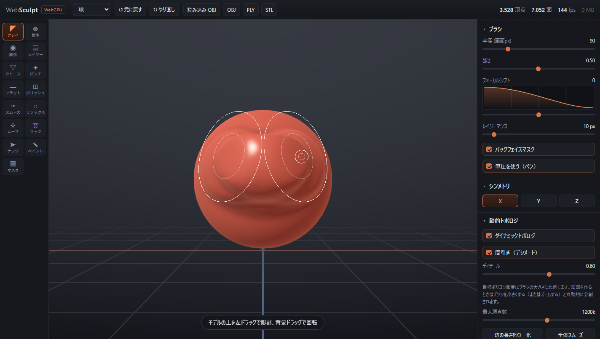
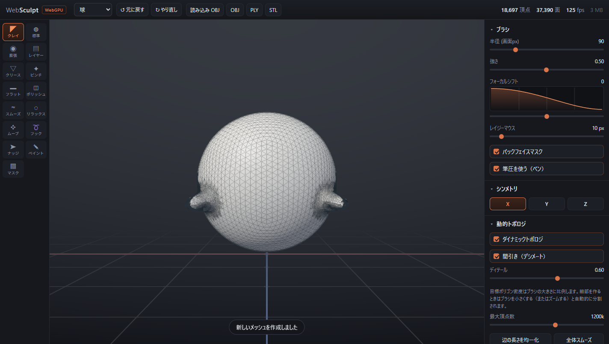
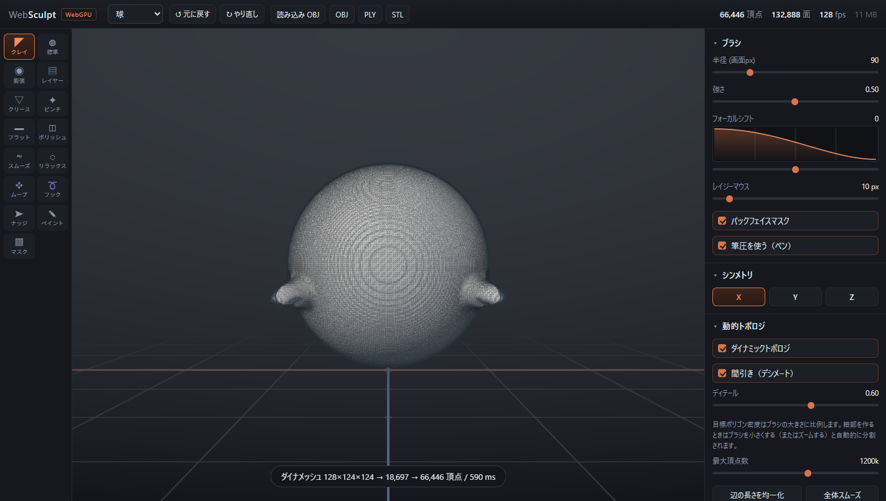

# WebSculpt

**▶ [ブラウザで開く](https://terman0407.github.io/web-sculpt/)** — インストール不要（WebGPU 対応ブラウザが必要）

ブラウザだけで動く ZBrush ライクな 3D スカルプトツール。レンダリングは **WebGPU**、
彫刻ロジックは素の JavaScript。ビルドステップ・外部ライブラリ・外部アセットは一切なし。



## 起動

### いちばん簡単（Node 不要・サーバー不要）

**`websculpt.html` をブラウザで開くだけ**です。全モジュールと CSS を 1 枚にまとめた
自己完結ファイル（約 270 KB）なので、ダブルクリックで `file://` から動きます。
WebGPU は `file://` でも secure context として扱われるため、特別なフラグも要りません。

### モジュール版を触りたいとき

`js/` 以下を直接編集して試す場合は ES モジュールの制約で http 経由が必要です。
Node の有無どちらでも用意してあります。

```sh
# Node なし（Windows 標準の PowerShell だけ）
powershell -ExecutionPolicy Bypass -File serve.ps1

# Node あり
node server.mjs        # または npm start
```

編集した内容を単一ファイル版に反映するには（このときだけ Node が必要）:

```sh
node build.mjs         # → websculpt.html を再生成
```

### GitHub Pages で公開する

相対パスしか使っていないので、リポジトリに push するだけで動きます。
`.github/workflows/pages.yml` を同梱しているので、

1. リポジトリを作って push（`main` または `master`）
2. Settings → Pages → Source を **GitHub Actions** にする

（このリポジトリは既に設定済みで、https://terman0407.github.io/web-sculpt/ で公開されています）

これで push ごとに「コアテスト → 単一ファイル版のビルド → 公開」が走ります。
公開される URL は `https://<user>.github.io/<repo>/`。
ワークフローは `websculpt.html` をソースから作り直すので、コミットし忘れても最新版が出ます。
`.nojekyll` を置いてあるため `_` 始まりのファイルも消されません。

**対応ブラウザ**: Chrome / Edge 113+、Safari 18+、WebGPU を有効にした Firefox。
`chrome://gpu` で WebGPU の状態を確認できます。

## 操作

| 操作 | 内容 |
|---|---|
| 左ドラッグ（モデル上） | 彫刻 |
| 左ドラッグ（背景）/ 右ドラッグ | 回転 |
| 中ドラッグ / Space + 左ドラッグ | 平行移動 |
| — | 回転・平行移動はどちらも「掴んだ点がカーソルに追従する」向き（下へドラッグ＝手前側が下がる）。逆が好みなら〔表示〕→〔カメラ縦回転を反転〕 |
| ホイール | ズーム |
| **Shift** + ドラッグ | スムーズ（どのブラシ中でも呼べる） |
| **Alt** + ドラッグ | ブラシ反転（盛る → 掘る） |
| **Ctrl** + ドラッグ | マスクを塗る（マスク部分は彫刻されない） |
| **Ctrl + Alt** + ドラッグ | マスクを消す |
| `1` … `0` | ブラシ切り替え |
| `[` `]` | ブラシ半径 |
| `,` `.` | ブラシ強さ |
| `X` / `G` / `W` / `A` / `M` | X ミラー / 動的トポロジ / ワイヤフレーム / AO / マテリアル |
| `L` / `B` / `H` | レイジーマウス / バックフェイスマスク / フロアグリッド |
| `D` | ダイナメッシュ実行 |
| `PageUp` / `PageDown` | 分割レベルを上げる / 下げる |
| `F` | モデル全体を表示 |
| `Ctrl+Z` / `Ctrl+Shift+Z` | 元に戻す / やり直し |

## 機能

**ブラシ 15 種** — クレイビルドアップ / スタンダード / インフレート / レイヤー / クリース /
ピンチ / フラット / hPolish / スムーズ / リラックス / ムーブ / スネークフック / ナッジ /
ペイント（ポリペイント）/ マスク。

- **レイヤー** はストローク内の累積を持ち、同じ場所を何度なでても一定の高さで止まります（段差やリボン状の形に）
- **hPolish** は平面より出ている側だけを削るので、彫刻を崩さず硬い面が作れます
- **リラックス** は接線方向だけのラプラシアンで、形を保ったままポリゴンの分布を整えます
- **スネークフック** は鋭い減衰で強く引き、動的トポロジと組み合わせて角や触手を伸ばします

**ブラシの当たり** — ZBrush の Focal Shift 相当の減衰カーブ（＋で中心が平らになり硬く、
−で柔らかく。カーブはパネル上でプレビューされます）、**レイジーマウス**（カーソルから一定距離
だけ遅れて追従するリード方式。手ぶれだけがきれいに落ち、フレームレートに依存しません）、
**ペンタブレットの筆圧**（半径と強さへの反映量を個別に調整）、
**バックフェイスマスク**（視点から裏を向いた面を彫らない）。

**動的トポロジ（Sculptris Pro 相当）** — ストローク中にブラシ領域だけを辺分割 /
辺コラプスして目標エッジ長に近づけます。目標密度は**ブラシの大きさに比例**するので、
細部を作りたいときはブラシを小さくする（またはズームする）だけで自動的に分割されます。
「間引き」をオフにすると既存の密度を保ったまま変形します。

**ダイナメッシュ** — モデル全体をボクセル化して均一なトポロジに作り直します（`D` キー）。
引き伸ばして密度が偏ったメッシュを均し、めり込ませた形状や分離した部品を**和集合として結合**、
自己交差も解消します。「ラフに形を出す → ダイナメッシュ → 彫り込む」の反復が基本の流れです。

| ダイナメッシュ前 | ダイナメッシュ後 |
|---|---|
|  |  |
| 突起だけ 57,440 頂点まで密になっている | 12,132 頂点の均一なトポロジ（661 ms） |

**分割レベル（SDiv）** — Divide でポリゴンを 4 倍にし、レベルを上下できます。
低いレベルで大きな形を整えると、高いレベルの細部が**ローカル座標系に保存された変位**として
追従します。動的トポロジやダイナメッシュで接続が変わるとレベルは破棄されます
（ZBrush でも Sculptris Pro と SDiv は併用できません）。

**シンメトリ** — X / Y / Z を任意に組み合わせ（最大 8 ミラー同時）。原点を通る平面が基準。

**マテリアル** — MatCap 10 種を起動時に手続き的に生成（レッドワックス / ホワイトクレイ /
スキン / パール / クローム / ダークストーン / ベーシック / トイプラスチック / ゴールド /
ジェイド）。外部画像は不要です。

**キャビティシェーディング** — 離散平均曲率から溝を暗く、稜線をわずかに明るくします。
ZBrush で彫刻の形が読み取りやすいのはこの成分によるところが大きく、SSAO（広い範囲の陰）と
キャビティ（細かい溝）を併用すると形が一気に読めるようになります。

**フロアグリッド** — モデルの底に置かれ、軸を色分け（X = 赤 / Z = 青）した床。
`fwidth` による解析的なアンチエイリアスと、カメラ距離に応じたフェード付き。

**ブラウザ内保存** — 名前付きスロットに保存 / 読み込み / 削除。ストロークの 4 秒後に
自動保存され、次回起動時に復元を提案します。メッシュ本体は IndexedDB（localStorage は
5MB 前後で足りない）、UI 設定は localStorage に入ります。

**入出力** — OBJ 読み込み。OBJ（頂点カラー付き）/ PLY（ポリペイント保持）/
STL（3D プリント向け）書き出し。

## レンダリングパイプライン

| パス | 種別 | 内容 |
|---|---|---|
| 1 | render | 背景 → メッシュ（MatCap + キャビティ）→ フロアグリッド → ワイヤフレーム → `colorTex` / `normalTex` / `depthTex` |
| 2 | **compute** | SSAO（24 サンプル半球、深度 + ビュー空間法線から） |
| 3 | **compute** | 深度を考慮した 5×5 AO ブラー |
| 4 | **compute** | ピッキング（カーソル周辺の深度を探索して逆射影、16 バイトだけ返す） |
| 5 | render | FXAA → AO 合成 → linear→sRGB → canvas |
| 6 | render | ブラシリングのオーバーレイ |

## 実装上の要点

**メッシュ表現** — 頂点 / 三角形は削除しても配列を詰めません。削除された三角形は
`(0,0,0)` の退化三角形に書き換わり、ラスタライザが 1 フラグメントも生成しないため
インデックスバッファを作り直す必要がありません。空きスロットはフリーリストで再利用します。
これにより辺分割 / コラプス中に ID が一切ずれず、動的トポロジの実装が単純になります。
無駄が 20% を超えたらストローク終了時に圧縮します。

**GPU 転送** — 頂点属性は非インターリーブの 5 バッファ（位置 / 法線 / 色 / マスク / 曲率）。
CPU 側の `Float32Array` をそのまま dirty レンジ転送できるため、彫刻中の再パックが不要です。

**ブラシ領域の抽出** — 空間分割構造を持ちません。ストローク開始時のみ全頂点走査で
シード頂点を求め、以降は 1-ring 最急降下でシードを追従させ、メッシュの連結性に沿った
フラッドフィルで領域を集めます。結果として「近いが繋がっていない面」に滲みません。

**ピッキング** — CPU 側に BVH を持たず、深度バッファをコンピュートシェーダーで読んで
逆射影します。O(1) でオクルージョン込みの正確な表面座標が得られます。
（深度テクスチャは `copyTextureToBuffer` でサブリソース全体しかコピーできないため、
compute 経由で 1 点だけ返すのが要点です。）

**ストロークのダブ間隔** — フレームレートではなくカーソルの移動距離に比例してダブを
打つため、環境によって効果量が変わりません。

**ダイナメッシュ** — 辺の分割 / 統合ではトポロジの繋がりを変えられないため、
別経路でボクセル化して作り直します。

1. AABB を覆うグリッドを張る（軸平行な面がグリッド頂点に乗ると内外判定が不定になるので、
   原点を `h` の無理数倍だけずらして退化を避ける）
2. 三角形スプラットで狭帯域の符号なし距離場を作り、最近傍三角形も記録する
3. Z 方向スキャンラインの**符号付き交差数（巻き数）**で内外を決める。パリティ（XOR）ではなく
   巻き数なので、重なった部品や自己交差が正しく**和集合**になる
4. Surface Nets（デュアルコンタリング）で等値面を抽出
5. 抽出結果を必ず閉多様体に直す修復パス（後述）
6. Taubin スムージング（λ で縮め μ で戻すので体積がほぼ保たれる）
7. 記録した最近傍三角形から頂点カラーを引き直してポリペイントを保持

Surface Nets は 1 セルに 1 頂点しか置かないため、1 ボクセル程度しか厚みのない部分では
1 頂点が 2 枚のシートに共有されて非多様体になり得ます（デュアルコンタリング共通の限界）。
彫刻側は多様体を前提にしているので、抽出後に「3 枚以上の面が付いた辺の間引き → 面の連結成分が
複数ある頂点の複製 → 空いた穴の重心ファン閉じ」で必ず閉多様体へ直します。
実測では 1. のグリッドジッタだけで大半の退化が消えるため、この修復は保険として働きます。

境界のあるメッシュ（読み込んだ開いた形状や平面プリミティブ）は巻き数が使えないので、
符号なし距離を厚みでオフセットしてシェル化します（平面をダイナメッシュすると板になる）。

## テスト

```sh
npm test               # コアロジック（多様体性・オイラー標数・Undo・入出力）
npm run test:gpu       # ヘッドレス Chrome で WGSL コンパイルと全パイプラインを検証
npm run test:e2e       # 実マウスイベントでの彫刻・回転・ズーム・ショートカット
npm run test:e2e:file  # 同じ E2E を単一ファイル版（file://）に対して実行
npm run shots          # test/shots/ にスクリーンショットを保存
npm run bench          # CPU 側（彫刻・ダイナメッシュ）のベンチマーク
npm run bench:gpu      # 設定別のフレーム時間
npm run bench:wasm     # WASM 版カーネルとの速度 / 出力一致の比較
npm run bench:dynamesh # 入力ポリゴン数に対するダイナメッシュのスケーリング
```

GPU 系テストは Chrome / Edge を自動検出して CDP 経由で駆動します（追加パッケージ不要）。
別の場所にある場合は `CHROME_PATH` を設定してください。WebGPU 有効化フラグは渡していない
ので、利用者が普通にブラウザで開いた状態と同じ条件で検証しています。

`serve.ps1` 経由で配信した状態を検証したい場合:

```sh
node test/interaction.mjs --url http://localhost:8080
```

`npm test` は全ブラシ × 動的トポロジ ON/OFF の全組み合わせでストロークを走らせ、
毎回「各辺がちょうど 2 面に共有されているか」「オイラー標数が保たれているか」
「ring の双方向整合性」「NaN の混入」を検証します。

## ファイル構成

```
websculpt.html      ★ 単一ファイル版（生成物・これを開けば動く）
build.mjs           単一ファイル版を生成するバンドラ
index.html          モジュール版の UI の骨組み
css/style.css
js/main.js          状態・入力・メインループ
js/renderer.js      WebGPU デバイス / パイプライン / 転送 / ピッキング
js/shaders.js       WGSL（9 モジュール）
js/matcap.js        MatCap の手続き的生成
js/mesh.js          動的トポロジ対応メッシュ + プリミティブ
js/dyntopo.js       辺分割 / 辺コラプス
js/dynamesh.js      ボクセル化 → Surface Nets → 多様体修復
js/subdiv.js        分割レベル（マルチレゾ変位）
js/store.js         IndexedDB / localStorage への保存
js/brushes.js       ブラシ 1 ダブの実装
js/sculptor.js      ストローク制御 / シンメトリ / アンドゥ
js/camera.js        軌道カメラ
js/math.js          vec3 / mat4
js/io.js            OBJ / STL / PLY
js/ui.js            DOM パネル
.github/workflows/  GitHub Pages への自動デプロイ
serve.ps1           PowerShell 製の静的サーバ（Node 不要）
server.mjs          Node 製の静的サーバ（依存ゼロ）
test/               テストとスクリーンショット
```

`build.mjs` は `import` / `export` を小さなモジュールレジストリに書き換えて
依存順に連結するだけの単純なバンドラです。import した名前が実際に export されて
いるかをビルド時に検証し、未対応の構文（`export default` など）が混ざったら
エラーで止まります。単一ファイル版に対しても E2E テストを流して、モジュール版と
同一の結果になることを確認しています。

## 性能

計測は `npm run bench`（CPU）/ `npm run bench:gpu`（描画）/ `npm run bench:wasm`（WASM 比較）。
以下は RTX 4000 系・1176x859 レンダーターゲットでの実測値。

**実使用時のフレーム時間** — 14.5 万頂点を彫刻しながらで中央値 6.9 ms（144fps の vsync 張り付き）、
p95 7.3 ms。うち CPU 側の彫刻処理は平均 0.64 ms/フレームなので、描画も彫刻も
フレーム予算に対して十分な余裕がある。

**最適化で効いた点**（合計 2.3 倍）:

| 項目 | 前 | 後 |
|---|---|---|
| ストローク（30 サンプル / 12 万頂点） | 382 ms | 180 ms |
| ストローク（30 サンプル / 30 万頂点） | 631 ms | 302 ms |
| 曲率の全再計算（15 万頂点） | 46.8 ms | 8.9 ms |
| 隣接リスト再構築（15 万頂点） | 41.3 ms | 17.0 ms |
| アンドゥ（15 万頂点） | 65.2 ms | 34.8 ms |
| ダイナメッシュ res96 | 919 ms | 321 ms |
| MatCap 生成（起動時） | 173 ms | 9 ms（表示中の 1 枚のみ） |
| 彫刻中の p95 フレーム時間（過負荷条件） | 833 ms | 26 ms |

内訳:

- **辺分割ループの一時配列を排除** — 三角形ごとに `[a, b, c]` を作っていたのをスカラに。
  1 ダブで数千回通るため、これだけでストロークが 2.4 倍速くなった。
- **曲率計算を三角形駆動に** — 頂点ごとに ring 配列を辿る代わりに三角形を 1 回走査して
  隣接和を積む。配列間接参照が消えて 5.3 倍。
- **曲率をフレーム単位に遅延** — 曲率は陰影にしか使わないので、ダブごとではなく
  フレーム末に 1 回だけまとめて計算する。
- **距離場の下界カリング** — voxel から三角形 AABB までの距離は真の距離の下界になる。
  軸ごとに外へ括り出して、更新され得ない voxel の距離計算を丸ごと省く（ダイナメッシュ 2.9 倍）。
- **1 フレームの作業量に上限** — カーソルが大きく飛んだときに数十ダブ × 数千頂点生成で
  数百 ms 固まっていた。時間予算と 1 ダブあたりの生成上限で有界にした。
- **隣接リストの配列を使い回す** — 再構築のたびに頂点数ぶんの小さい配列を作り直していた。

### ダイナメッシュのスケーリング（3M ポリゴン基準）

`npm run bench:dynamesh` で入力ポリゴン数に対する内訳を測れる（res=128 固定）。

| 入力面数 | 最適化前 | 現在 | 距離場 | 内外判定 |
|---|---|---|---|---|
| 82k | 338 ms | **288 ms** | 119 | 38 |
| 328k | 541 ms | **338 ms** | 209 | 39 |
| 750k | 859 ms | **401 ms** | 286 | 34 |
| 1.31M | 1616 ms | **590 ms** | 446 | 59 |
| **3.00M** | **3830 ms** | **1045 ms** | 839 | 61 |

3M で 3.7 倍。ピーク時ヒープも 819 MB → 339 MB。効いたのは 3 点:

1. **境界判定の作り直し（47 倍）** — 「境界辺があるか」という真偽値 1 個のために
   全辺を Map に入れていた（300 万面で 900 万件、1.45 秒）。実際に知りたいのは
   「巻き数が信用できるか」なので、スキャンラインを走査し終えた時点で巻き数が
   0 に戻るかで判定するようにした（追加コスト 0）。内側と判定された voxel が
   0 個のケース（XZ 平面に乗った板など、Z レイへの射影面積が 0 で交差を生まない形状）も
   開いた面として扱う。
2. **走査範囲の floor/ceil の取り違え** — 格子点 i の座標は `ox + i*h` なので
   下限は ceil、上限は floor が正しい。逆に取っていたため軸ごとに 2 セル余分に
   回っていた（点に近い三角形で 7³ 対 5³）。
3. **距離場の WASM 化（1.8 倍）** — 下記。

### WASM

距離場スプラット（ダイナメッシュの約 9 割を占める）を AssemblyScript で書き、
**本体に組み込んである**（`assembly/dynafield.ts` → `wasm/dynafield.wasm`、4.7 KB）。

- 起動時に非同期で読み込み、間に合わなければ **JS 版へ自動フォールバック**するので、
  読み込みに失敗しても機能は落ちない。
- 出力は JS 版と**ビット単位で完全一致**。`npm test` が両経路の結果を突き合わせて検証する。
- 3M ポリゴンで距離場 1535 ms → 839 ms（1.8 倍）、全体 1711 ms → 1045 ms。

GitHub Pages での動作条件:

- `.wasm` は静的ファイルとして `application/wasm` で配信される（ワークフローが `wasm/` をコピー）。
- **単一スレッドなので制約なし。** 単一ファイル版はビルド時に base64 で埋め込むため
  fetch を使わず、`file://` からも WASM 経路が有効になる。
- **マルチスレッド（SharedArrayBuffer）は不可。** COOP/COEP レスポンスヘッダが必要だが
  GitHub Pages はヘッダを設定できない。Service Worker で合成する回避策はあるが、
  初回リロードが必要になり `file://` では動かないので採用していない。

`npm install && npm run build:wasm` で `.wasm` を作り直せる（AssemblyScript は
devDependency で、実行時には不要）。

### 残っている制約

- ダイナメッシュの出力解像度は密な 3D グリッドの上限（2400 万 voxel）に縛られる。
  res 288 相当が上限で、出力はおおむね 50 万面まで。それ以上を狙うなら
  ブロック疎グリッド（VDB 的な構造）への作り替えが必要。
- 3M ポリゴンでもダイナメッシュは約 1 秒かかる同期処理。実行中はオーバーレイを出すが
  UI は止まる。

## 既知の制限

- アンドゥはメッシュ全体のスナップショット方式です。件数 24 件かつ合計 320MB を上限に
  古い履歴を捨てます（差分方式ではありません）。
- 動的トポロジは三角形メッシュ専用です。読み込んだ四角形ポリゴンは三角形化されます。
- シンメトリ平面は原点を通る軸平面に固定です（読み込み時にモデルを原点中心へ正規化します）。
- 彫刻処理は CPU（シングルスレッド）です。数十万頂点までは 60fps を維持できますが、
  それ以上では「ディテール」を下げるか「最大頂点数」で上限を設けてください。
- ダイナメッシュは同期処理です（解像度 120 で約 0.7 秒）。実行中はオーバーレイを出しますが
  その間 UI は反応しません。解像度は最長辺方向のボクセル数で、総ボクセル数が 2,400 万を
  超える場合は自動的に落とされます。
- ダイナメッシュの解像度より薄い形状（1 ボクセル未満の板や、接するほど近い 2 面）は
  つぶれて融合します。ZBrush の DynaMesh と同じ性質で、解像度を上げれば解消します。
- MSAA は使わず FXAA で代替しています（深度テクスチャを SSAO とピッキングで
  読む必要があるため）。
- 分割レベルの変位は「粗い面から予測される位置との差」をローカル座標系（接線 / 従接線 / 法線）で
  保存します。粗いレベルを大きく変形しても細部は追従しますが、Catmull-Clark ではなく中点分割なので
  Divide 自体は形を滑らかにしません（必要なら〔全体スムーズ〕を併用してください）。
- ブラウザ内保存は端末・ブラウザごとに独立しています。他の環境へ持ち出すには OBJ / PLY で
  書き出してください。分割レベルは保存されません（現在のレベルのメッシュのみ）。
